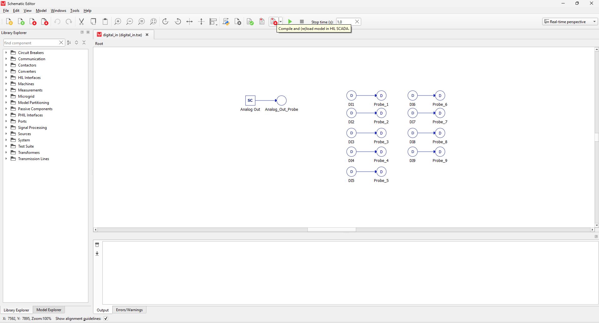
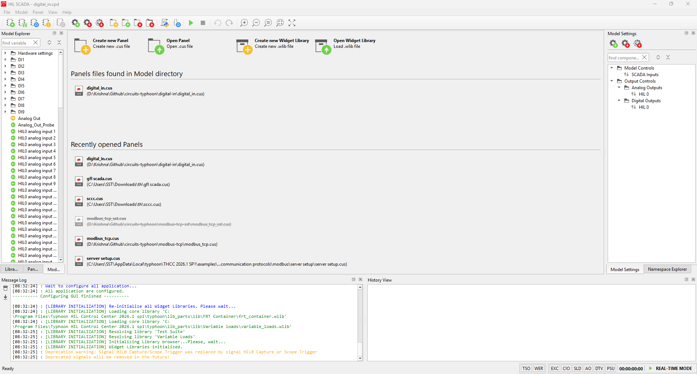
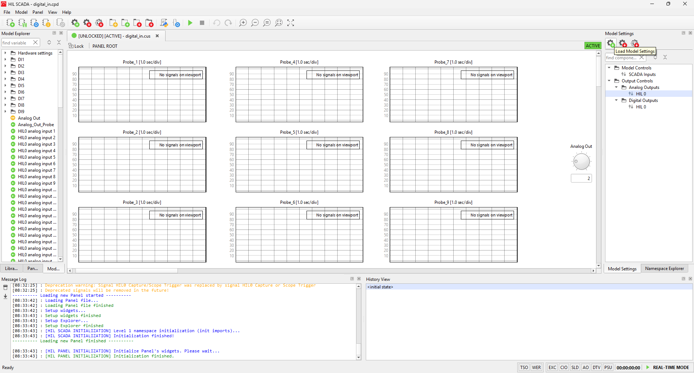

# Steps

- `Device Manager` $\rightarrow$ Select `Typhoon HIL 604`

    

    

- `Schematic Editor` $\rightarrow$ Open `digital_in.tse`

    

    

    

- Click `Compile and (re)load model in HIL SCADA` 

    

- Open `digital_in.cus`

    

- Click `Load MOdel Settings` $\rightarrow$ Choose `digital_in.runx`

    

