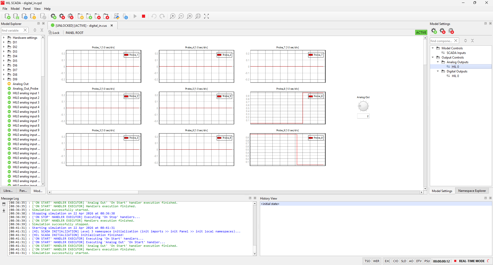

# Steps

- `Device Manager` $\rightarrow$ Select `Typhoon HIL 604`

    

    

- `Schematic Editor` $\rightarrow$ Open `digital_in.tse`

    

    

    

- Click `Compile and (re)load model in HIL SCADA` 

    

- Open `digital_in.cus`

    

- Click `Load Model Settings` $\rightarrow$ Choose `digital_in.runx` $\rightarrow$ Run simulation

    

# Result

- Probe 8 and 9

    

# Pinouts

`DI1` - `DI9` and `AO1` (for testing)

> [!NOTE]
> [Pinout documentation](https://www.typhoon-hil.com/documentation/typhoon-hil-hardware-manual/hil604_user_guide/References/hil604_pinout.html)